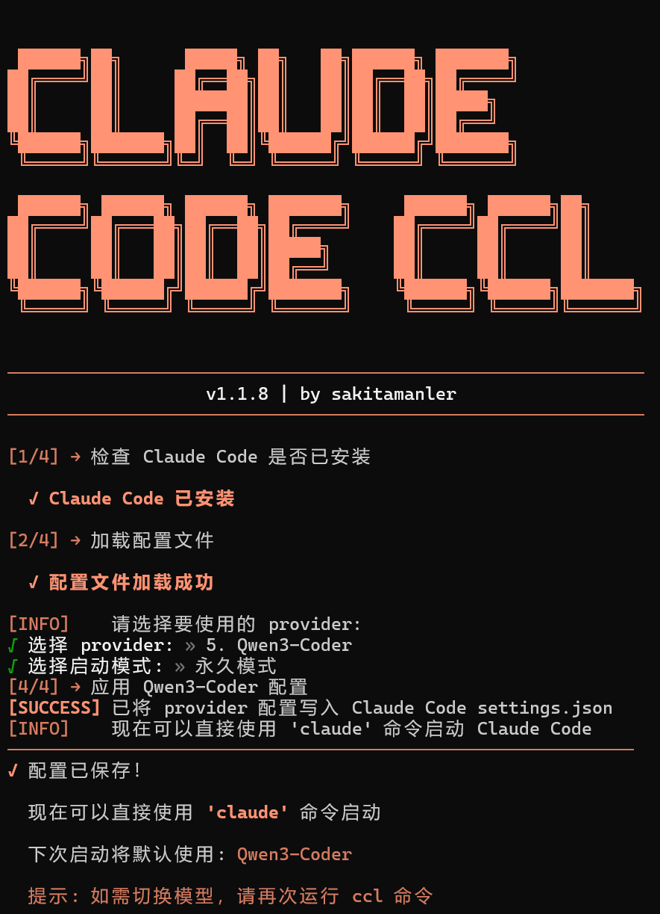

<div align="center">

<pre>
&#32;&#32;&#32;&#32;██████╗██╗      █████╗ ██╗   ██╗██████╗ ███████╗
&#32;&#32;&#32;██╔════╝██║     ██╔══██╗██║   ██║██╔══██╗██╔════╝
&#32;██║     ██║     ███████║██║   ██║██║  ██║█████╗
&#32;██║     ██║     ██╔══██║██║   ██║██║  ██║██╔══╝
&#32;&#32;&#32;╚██████╗███████╗██║  ██║╚██████╔╝██████╔╝███████╗
&#32;&#32;&#32; ╚═════╝╚══════╝╚═╝  ╚═╝ ╚═════╝ ╚═════╝ ╚══════╝

&#32;&#32;██████╗ ██████╗ ██████╗ ███████╗     ██████╗ ██████╗██╗
&#32;██╔════╝██╔═══██╗██╔══██╗██╔════╝    ██╔════╝██╔════╝██║
&#32;██║     ██║   ██║██║  ██║█████╗      ██║     ██║     ██║
&#32;██║     ██║   ██║██║  ██║██╔══╝      ██║     ██║     ██║
&#32;&#32;&#32;&#32;&#32;&#32;╚██████╗╚██████╔╝██████╔╝███████╗    ╚██████╗╚██████╗███████╗
&#32;&#32;&#32;&#32;&#32;&#32;&#32;╚═════╝ ╚═════╝ ╚═════╝ ╚══════╝     ╚═════╝ ╚═════╝╚══════╝
</pre>

# 🚀 Claude Code Launcher (ccl)

### 让 Claude Code 支持多模型切换，轻松使用国产优秀大模型

[](https://opensource.org/licenses/MIT)
[](https://nodejs.org)
[](https://www.npmjs.com/package/sakitamanler-ccl-launcher)

[English](./README_EN.md) | 简体中文

</div>

---

## 📖 项目简介

**ccl** (Claude Code Launcher) 是一个强大的 Claude Code 模型启动器，让你可以轻松切换使用不同的 AI 模型作为 Claude Code 的后端。

本项目基于以下两个优秀开源项目进行二次开发：
- **[claude-code-launcher](https://github.com/FullStackPlayer/claude-code-launcher)** - 核心功能框架
- **[ccl-cli](https://github.com/FullStackPlayer/ccl-cli)** - CLI 安装器架构

运行以下两条命令即可使用，推荐使用modelscope生成访问令牌，一天拥有2000次免费调用https://www.modelscope.cn/docs/accounts/token。

```
npm install -g sakitamanler-ccl-launcher
ccl  # 交互式选择模型
```

<p align="center">
  
</p>

---

## 🎯 为什么需要 ccl？

### Claude Code 的缺憾

在 Coding Agent 领域，**Claude Code** 是当之无愧的王者。但对中国开发者来说，它有两个无法忽视的缺憾：

1. **模型锁定** - 官方只支持 Anthropic 自家的 Claude 系列模型
2. **地域限制** - Anthropic 对中国开发者不够友好

### 国产大模型的崛起

2025 年下半年，国产开源编程大模型迎来爆发式发展：

| 模型 | 特点 |
|:---|:---|
| 🏆 **智谱 GLM-4.7** | 性能卓越，官方支持 |
| 🚀 **MiniMax M2.1** | 代码能力出色 |
| 💎 **DeepSeek V3.2** | 物超所值 |
| 🌙 **Kimi K2** | 思考链模型 |
| ⚡ **Qwen3-Coder** | 通义千问，ModelScope 生态 |

更重要的是，这些厂商都**官方提供了 Anthropic 兼容 API 接口**，并推出了程序员专属套餐！

---

## ✨ 功能特点

| 特性 | 说明 |
|:---|:---|
| 🤖 **多模型支持** | GLM-4.7、MiniMax-M2.1、DeepSeek-3.2、Kimi-K2、Qwen3-Coder |
| 🎨 **交互式界面** | 美观的 TUI 选择界面，支持数字键快捷选择 |
| ⚡ **快速启动** | 支持 `--provider` 参数指定模型 |
| 📝 **单次请求** | 快速问答并保存结果 |
| 🔄 **跨平台** | Windows、macOS、Linux 全覆盖 |
| 📦 **全局安装** | 安装成系统命令，随处可用 |

---

### 🚀更新

```bash
# 强制重新安装最新版本
npm uninstall -g sakitamanler-ccl-launcher
npm install -g sakitamanler-ccl-launcher@latest
```

### 前置要求

```bash
# 1. Node.js (>=18.0.0)
#    访问 https://nodejs.org 下载安装

# 2. Claude Code（可选，未安装会自动提示）
npm install -g @anthropic-ai/claude-code
```

### 基本使用

```bash
# 交互式选择模型（推荐）
ccl

# 指定模型启动
ccl --provider=GLM-4.7

# 查看帮助
ccl --help

# 查看版本
ccl --version
```

---

## 📋 支持的模型

| Provider | 模型 | 开发商 | 文档链接 |
|:---|:---|:---|:---|
| **GLM-4.7** | 智谱 GLM-4.7 | 智谱 AI | [文档](https://docs.bigmodel.cn/cn/guide/develop/claude) |
| **MiniMax-M2.1** | MiniMax M2.1 | MiniMax | [文档](https://platform.minimaxi.com/docs/guides/text-ai-coding-tools) |
| **DeepSeek-3.2** | DeepSeek V3.2 | 深度求索 | [文档](https://api-docs.deepseek.com/zh-cn/guides/anthropic_api) |
| **Kimi-K2** | Kimi K2 | 月之暗面 | [文档](https://platform.moonshot.cn/docs/guide/agent-support) |
| **Qwen3-Coder** | Qwen3-Coder | 通义千问 | [ModelScope](https://modelscope.cn) |

---

## ⚙️ 如何使用（配置文件）

首次运行ccl命令会在可执行文件同级目录下创建 `ccl.config.json`：

```json
{
  "providers": {
    "GLM-4.7": {
      "description": "智谱最新模型",
      "base_url": "https://open.bigmodel.cn/api/anthropic",
      "auth_token": "YOUR_API_KEY",
      "api_timeout_ms": "3000000"
    },
    "MiniMax-M2.1": {
      "description": "MiniMax M2.1 模型",
      "base_url": "https://api.minimaxi.com/anthropic",
      "auth_token": "YOUR_API_KEY"
    },
    "DeepSeek-3.2": {
      "description": "DeepSeek V3.2 模型",
      "base_url": "https://api.deepseek.com/anthropic",
      "auth_token": "YOUR_API_KEY"
    },
    "Kimi-K2": {
      "description": "Kimi K2 模型",
      "base_url": "https://api.moonshot.cn/anthropic",
      "auth_token": "YOUR_API_KEY"
    },
    "Qwen3-Coder": {
      "description": "通义千问 Qwen3-Coder",
      "base_url": "https://api-inference.modelscope.cn",
      "auth_token": "YOUR_MODELSCOPE_API_KEY"
    }
  },
  "default_provider": "GLM-4.7",
  "additionalOTQP": "请使用中文回答。"
}
```

> **提示**：请进入程序生成的目录将 `auth_token` 替换为您自己的 API 密钥。

---

## 🎮 命令行参数

### 指令类参数

| 参数 | 说明 |
|:---|:---|
| `--provider=<name>` | 指定模型名称 |
| `--prompt=<text>` | 指定提示词 |
| `--output=<file>` | 指定输出文件 |
| `--pwd=<path>` | 指定工作目录 |

### 响应类参数

| 参数 | 简写 | 说明 |
|:---|:---:|:---|
| `--config-file` | `-cf` | 显示配置文件路径 |
| `--version` | `-v` | 显示版本号 |
| `--help` | `-h` | 显示帮助信息 |

### 使用示例

```bash
# 交互式选择
ccl

# 指定模型启动
ccl --provider=MiniMax-M2.1

# 单次请求并保存结果
ccl --provider=GLM-4.7 --prompt="写一个冒泡排序" --output=bubble_sort.md

# 指定工作目录
ccl --provider=DeepSeek-3.2 --pwd="D:\Projects\my-app"
```

---

## 📦 项目结构

```
claude-code-launcher/
├── src/                    # 源代码
│   ├── index.ts            # 程序入口
│   ├── utils.ts            # 工具函数
│   ├── types.ts            # 类型定义
│   └── ccl.config.json     # 配置文件模板
├── packages/
│   ├── installer/          # 主安装器
│   └── win32-x64/          # Windows 子包
├── scripts/
│   └── build.ts            # 构建脚本
├── screenshot.png          # 运行截图
├── README.md               # 项目文档
└── package.json
```

---

<div align="center">

**如果这个项目对你有帮助，请给它一个 ⭐ Star！**

</div>
